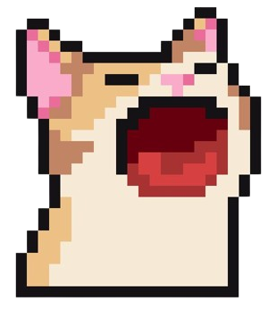
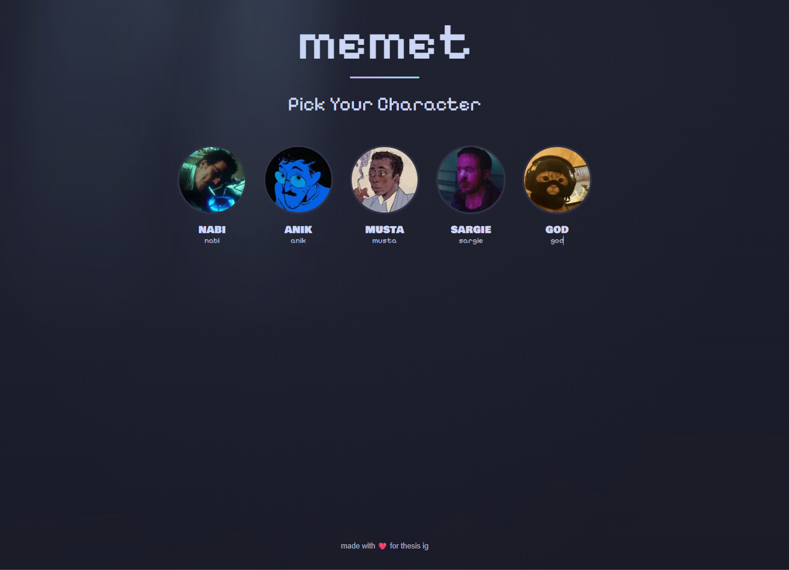
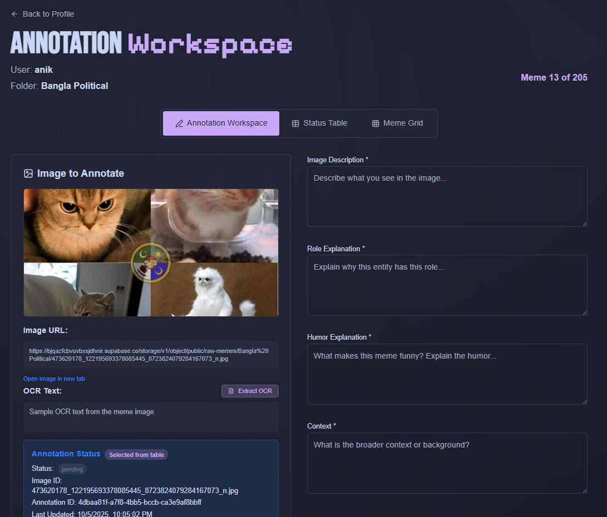

# memet

  

**Building our meme dataset for thesis research**

A collaborative annotation platform where 4 team members can split images, work together, and track progress on meme dataset creation.

## What it does

- **Smart Image Distribution**: Automatically splits meme images among team members
- **Collaborative Annotation**: Real-time progress tracking and workload management
- **Progress Dashboard**: Keep track of who's working on what
- **Leaderboard**: See team performance and completion stats

## Screenshots

### Home Dashboard

### Annotation Interface

## Tech Stack

- **Next.js** - React framework
- **TypeScript** - Type safety
- **Supabase** - Database & auth
- **Tailwind CSS** - Styling

---

_Built for thesis research - making meme annotation collaborative and efficient_
